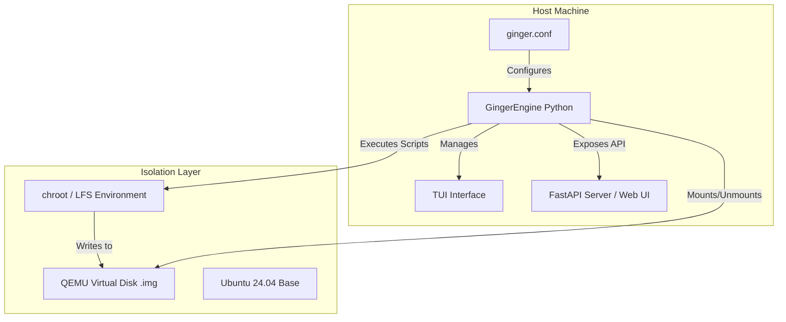
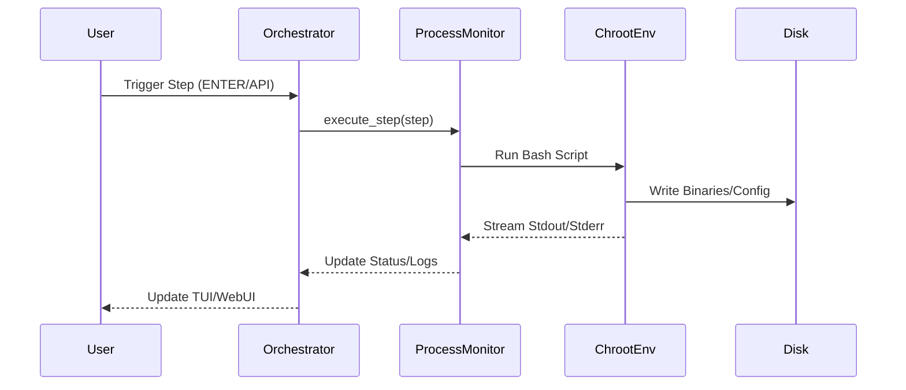

# GingerOS - System Analysis Report

## 🏗️ Software Architecture (Architect Perspective)

GingerOS is a **Command-First Build System** designed to automate the creation of a Linux distribution based on Linux From Scratch (LFS 13.0). It employs a "Zero-Host-Pollution" architecture, ensuring the host machine remains clean by isolating the entire build process.

### System Design

The system follows an **Orchestrator-Worker** pattern where a Python-based engine manages the execution of a series of predefined build steps.

#### Key Architectural Components:

- **Orchestrator (GingerEngine)**: The central brain that manages the build pipeline, tracks state, and handles process execution.
- **Isolation Layer (QEMU + chroot)**:
  - Uses a raw QEMU image (`.img`) as the target filesystem.
  - Employs `debootstrap` to create a minimal Ubuntu base.
  - Uses `chroot` and bind-mounts to execute build scripts inside the isolated environment, mimicking a "Docker-Exec" style workflow.
- **State Management**: Uses marker files in `.build_state/` and `/var/lib/ginger/` to track completed packages and steps, allowing for seamless resumes after failures.
- **Interface Layer**: Provides both a TUI (Terminal User Interface) and a Web UI (via FastAPI and WebSockets) for real-time monitoring and control.

### System Architecture Diagram



---

## 💻 Software Implementation (Developer Perspective)

### Code Structure

The project is organized into functional modules:

- `server/`: Contains the core logic.
  - `engine.py`: The main execution loop and state manager.
  - `build_steps.py`: Definition of the 15-step build pipeline.
  - `process_monitor.py`: Handles subprocess execution and real-time log streaming.
  - `mount_manager.py`: Manages the complex mounting/unmounting of the virtual disk and bind-mounts.
  - `models.py`: Data structures for build steps.
- `lfs/`: Contains the actual shell scripts that perform the LFS build.
  - `host/`, `image/`, `phase2-tools/`, `phase3-system/`: Organized by build phase.
- `config/`: Centralized constants and configuration loading.
- `ui/`: User interface implementations (TUI and Web).

### Implementation Details

- **Language**: Python 3 (Backend), Bash (Build Scripts), TypeScript/React (Web UI).
- **Key Libraries**:
  - `FastAPI` & `WebSockets`: For the web-based monitoring server.
  - `subprocess`: For executing shell commands.
  - `re`: For parsing logs and identifying package progress.
- **Coding Style**: Object-oriented approach in Python, with a strong emphasis on idempotency in Bash scripts (using `check_built` and `mark_built` functions).

### Data Flow Diagram



---

## 📦 Product Perspective (Product Manager Perspective)

### Core Purpose

GingerOS transforms the traditionally manual and error-prone process of building a Linux system from scratch into a managed, visual, and recoverable experience.

### Key Features

- **Neural Command Matrix**: A state-of-the-art React/Tailwind v4 web dashboard with a "High-Tech Glassmorphism" aesthetic.
- **Dynamic Resource Allocation**: Real-time control over CPU core usage (`-jN`) directly from the dashboard.
- **Advanced Telemetry**: Digital timers for package, phase, and overall build duration, plus CPU load and storage health meters.
- **Zero-Host-Pollution**: No need to install LFS dependencies on the host; everything happens in a virtual disk.
- **Command-Driven Control**: The user decides when to start, skip, or force-run steps.
- **Visual Progress Tracking**: A roadmap of all build steps with real-time status (Pending → Running → Completed → Failed).
- **Intelligent Recovery**: Marker-based skipping allows users to resume from the exact package that failed without restarting the entire phase.

### User Flow

1. **Launch**: User runs `python3 ginger_os.py`.
2. **Dashboard**: The Web UI automatically initializes at `http://localhost:8087`.
3. **Execution**: User presses `a` (Auto-run) in TUI or toggles "Auto Protocol" in the dashboard.
4. **Monitoring**: User watches live "Neural Stream" logs and Temporal Diagnostics.
5. **Optimization**: User adjusts "Core Allocation" slider to balance performance.
6. **Completion**: User runs `./qemu-run.sh` to boot their new OS.

```
1. Navigate to any step
2. Press f to force run
```

---

**Simple. Command-driven. Full control.**

## Requirements

- Python 3.8+
- `rich` library (`pip install rich`)
- `fastapi`, `uvicorn`, `psutil` for the web dashboard (`pip install fastapi uvicorn psutil`)
- Node.js & NPM (only for building the Web UI source)
- `qemu-utils` (for creating the raw image)
- `debootstrap` (for installing the Ubuntu Base container environment)

## Directory Structure

- `logs/`: Build logs for each step
- `.build_state/`: Internal state markers
- `sources/`: Downloaded tarballs (LFS sources)
- `lfs`: Build logic (Host, Phase 1-3)
